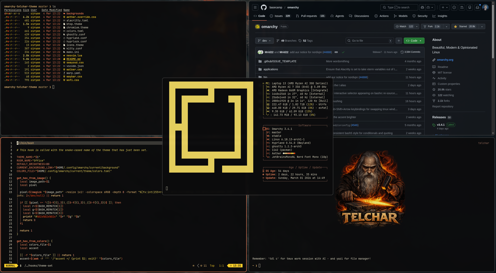

# Telchar -- Omarchy Theme

A dark **dwarven forge--inspired theme** for Omarchy / Hyprland
environments.

Telchar is inspired by the legendary dwarven smith from Tolkien lore.\
The theme captures the atmosphere of a **deep mountain forge**: dark
iron, glowing embers, molten metal, and warm golden light in darkness.

---

# Color Palette

Telchar uses a **forge-inspired palette** built around molten orange,
warm gold, and dark iron.\
The goal is strong contrast with a warm glow instead of the typical cold
dark theme.

## Core UI Colors

Role Color Description

---

Background `#0b0b0c` deep forge black
Foreground `#fcf6de` warm parchment white
Accent `#fc855a` molten orange
Active Border `#ffc7b3` heated metal glow
Selection Background `#fc855a` forge highlight
Selection Foreground `#0b0b0c` inverted contrast

### Visual Palette

<table>
  <tr>
    <td style="background:#0b0b0c;width:80px;height:40px"></td>
    <td style="background:#fcf6de;width:80px;height:40px"></td>
    <td style="background:#fc855a;width:80px;height:40px"></td>
    <td style="background:#ffc7b3;width:80px;height:40px"></td>
  </tr>
  <tr>
    <td align="center"><code>#0b0b0c</code></td>
    <td align="center"><code>#fcf6de</code></td>
    <td align="center"><code>#fc855a</code></td>
    <td align="center"><code>#ffc7b3</code></td>
  </tr>
</table>

---

# Terminal Colors (ANSI)

Color Hex Description

---

black `#0b0b0c` forge shadow
red `#ff4a14` ember red
green `#FBE266` golden alloy
yellow `#FED32B` molten gold
blue `#fc855a` hot metal glow
magenta `#fe9267` heated copper
cyan `#f7c67d` bright forge light
white `#EFDB8F` pale gold

### Visual ANSI Palette

<table>
  <tr>
    <td style="background:#0b0b0c;width:70px;height:35px"></td>
    <td style="background:#ff4a14;width:70px;height:35px"></td>
    <td style="background:#FBE266;width:70px;height:35px"></td>
    <td style="background:#FED32B;width:70px;height:35px"></td>
    <td style="background:#fc855a;width:70px;height:35px"></td>
    <td style="background:#fe9267;width:70px;height:35px"></td>
    <td style="background:#f7c67d;width:70px;height:35px"></td>
    <td style="background:#EFDB8F;width:70px;height:35px"></td>
  </tr>
  <tr>
    <td align="center"><code>#0b0b0c</code></td>
    <td align="center"><code>#ff4a14</code></td>
    <td align="center"><code>#FBE266</code></td>
    <td align="center"><code>#FED32B</code></td>
    <td align="center"><code>#fc855a</code></td>
    <td align="center"><code>#fe9267</code></td>
    <td align="center"><code>#f7c67d</code></td>
    <td align="center"><code>#EFDB8F</code></td>
  </tr>
</table>

---

# Bright Colors

Color Hex Description

---

bright black `#9c7160` cooled bronze
bright red `#ffa085` heated steel
bright green `#fff4be` bright alloy
bright yellow `#ffe686` radiant gold
bright blue `#ffc7b3` glowing metal
bright magenta `#ffd3c2` soft ember
bright cyan `#feecd1` forge light
bright white `#fcf6de` parchment white

### Visual Bright Palette

<table>
  <tr>
    <td style="background:#9c7160;width:70px;height:35px"></td>
    <td style="background:#ffa085;width:70px;height:35px"></td>
    <td style="background:#fff4be;width:70px;height:35px"></td>
    <td style="background:#ffe686;width:70px;height:35px"></td>
    <td style="background:#ffc7b3;width:70px;height:35px"></td>
    <td style="background:#ffd3c2;width:70px;height:35px"></td>
    <td style="background:#feecd1;width:70px;height:35px"></td>
    <td style="background:#fcf6de;width:70px;height:35px"></td>
  </tr>
  <tr>
    <td align="center"><code>#9c7160</code></td>
    <td align="center"><code>#ffa085</code></td>
    <td align="center"><code>#fff4be</code></td>
    <td align="center"><code>#ffe686</code></td>
    <td align="center"><code>#ffc7b3</code></td>
    <td align="center"><code>#ffd3c2</code></td>
    <td align="center"><code>#feecd1</code></td>
    <td align="center"><code>#fcf6de</code></td>
  </tr>
</table>

---

# Recommended Wallpapers

To preserve the Telchar atmosphere, wallpapers should include:

- volcanic landscapes
- dwarven halls or mountain fortresses
- blacksmith forges
- glowing embers or sparks in darkness
- dark fantasy environments with warm lighting

Avoid bright minimal or cold blue wallpapers, which break the theme
cohesion.

---

# License

MIT License
